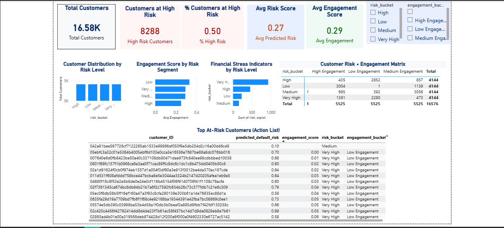
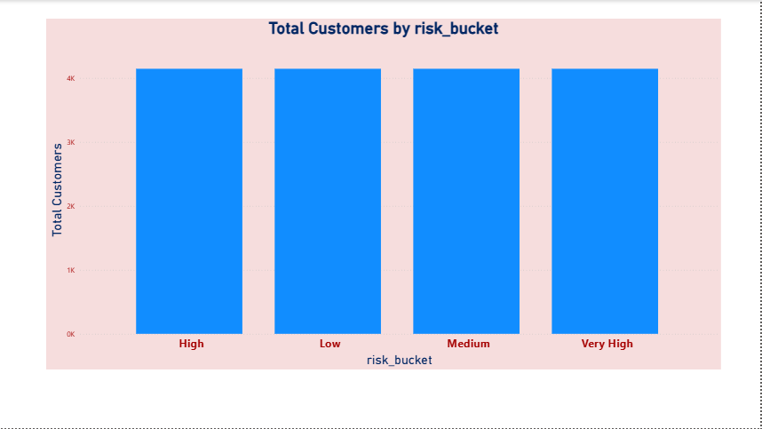
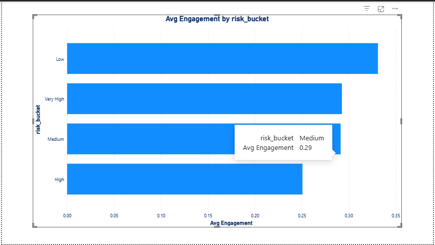
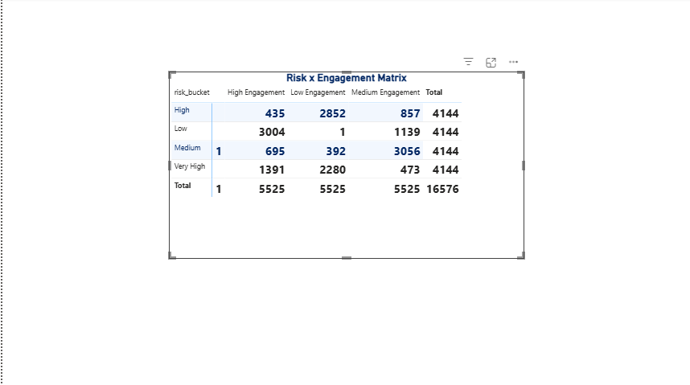

# 📌 Project Title

## **Customer Risk, Churn & Engagement Analytics – American Express (Case Study)**

---

## 🧠 Business Context

Financial services companies like American Express manage millions of cardmembers, where early identification of customer risk and disengagement is critical to:

* Reducing customer churn
* Preventing credit default
* Improving customer lifetime value
* Enabling proactive engagement strategies

This project demonstrates how **customer-level behavioral data** can be transformed into **actionable risk and retention insights** using analytics and machine learning.

---

## 🎯 Problem Statement

> How can we proactively identify customers at risk of default and disengagement, and translate those insights into targeted churn prevention and engagement strategies?

---

## 🧩 Solution Overview

This project builds an **end-to-end analytics pipeline** that:

* Aggregates large-scale behavioral data to the customer level
* Identifies key drivers of financial risk and disengagement
* Predicts customer default risk (used as a churn proxy)
* Translates model outputs into business-ready customer segments
* Recommends actionable engagement and retention strategies

---

## 🗂️ Data Description

* **Source:** Publicly available American Express Default Prediction dataset (Kaggle)
* **Granularity:** Monthly customer behavior
* **Scale:** Enterprise-scale dataset (sampled and aggregated for analysis)
* **Target Variable:** Default risk (used as an early churn / disengagement proxy)

> **Note:** Raw data is not included in this repository due to size and licensing constraints.

---

## 🏗️ Technical Approach

### 1️⃣ Data Engineering & Preparation

* Cloud-based data processing using Kaggle notebooks
* Representative sampling to handle large datasets efficiently
* Aggregation from monthly observations to customer-level features
* Leakage-safe label merging

### 2️⃣ Feature Engineering

* Behavioral engagement signals
* Financial stress indicators
* Composite engagement and risk scores

### 3️⃣ Exploratory Data Analysis (EDA)

* Risk distribution analysis
* Engagement vs default behavior
* Validation of behavioral patterns prior to modeling

### 4️⃣ Modeling

* Baseline Logistic Regression model for interpretability
* Median imputation using Scikit-learn pipelines
* ROC-AUC used as the primary evaluation metric due to class imbalance

### 5️⃣ Explainability & Risk Drivers

Key drivers identified:

* Declining engagement behavior
* Elevated financial stress indicators
* Consistent usage as a protective factor

### 6️⃣ Churn & Engagement Optimization

* Customer segmentation using predicted risk and engagement levels
* Actionable churn prevention and retention strategies
* Business-ready risk buckets for decision-making

---

## 📊 Key Insights

* Customers with low engagement and high financial stress exhibit significantly higher default risk
* Engagement decline acts as an early warning signal before default
* Combining risk scores with engagement metrics enables precise targeting of retention efforts

---

## 🧠 Business Recommendations

* Proactively target **high-risk, low-engagement customers** with personalized retention offers
* Provide support interventions for customers showing financial stress signals
* Upsell and reward **low-risk, high-engagement customers** to maximize lifetime value

---

## 📊 Dashboard Preview

This dashboard provides an executive view of customer risk and engagement, enabling stakeholders to identify at-risk customers, understand behavioral drivers, and take targeted retention actions.

### 🔹 Executive Overview

**Purpose:**
Provides a high-level summary of customer risk and engagement across the portfolio, including total customers, proportion of high-risk customers, average predicted risk score, and average engagement score.

---

### 🔹 Customer Distribution by Risk Level

**Insight:**
Shows how customers are distributed across risk segments (Low, Medium, High, Very High), helping quantify the size of the risk problem and where potential churn and default are concentrated.

---

### 🔹 Engagement Score by Risk Segment

**Insight:**
Average engagement decreases as risk increases, indicating that disengagement is an early warning signal of default and churn.
This validates the relationship between behavioral activity and financial risk observed during EDA.

---

### 🔹 Customer Risk × Engagement Matrix

**Insight:**
This matrix combines predicted risk and engagement level to form actionable customer segments:

* **High Risk + Low Engagement:** Immediate retention and support actions
* **High Risk + High Engagement:** Temporary financial stress, suitable for credit support
* **Low Risk + Low Engagement:** Re-engagement campaigns
* **Low Risk + High Engagement:** Upsell and loyalty opportunities

This framework converts model outputs into business-ready decisions.

---

## 🧠 How to Read the Dashboard

The dashboard follows a top-down decision flow:

1. **What is happening?** → Executive KPIs
2. **Why is it happening?** → Risk and engagement analysis
3. **What should be done?** → Actionable segmentation matrix

This structure ensures the dashboard supports both strategic and operational decision-making.

---

## 🛠️ Tech Stack

* Python (Pandas, NumPy)
* Scikit-learn
* Kaggle Notebooks (Cloud Execution)
* Power BI (for downstream visualization)

---

## 📈 Future Enhancements

* Integration with real-time transaction streams
* Advanced explainability using SHAP values
* Campaign uplift measurement for retention strategies

---

## ⚠️ Disclaimer

This project is a case study for educational and portfolio purposes.
It does not represent proprietary or confidential data from American Express.

---
